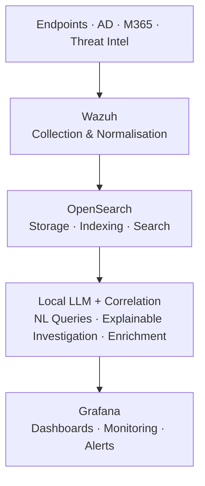

# HuzoHunter AI — Architecture

> Status: **Research & Development.** This document describes the *intended* design.
> Details will evolve as the platform matures.

## Design Principles

1. **Local-first / data sovereignty** — all telemetry and AI inference stay inside the
   customer environment. Nothing sensitive leaves the network.
2. **Explainability** — every AI-assisted conclusion is accompanied by the evidence and
   reasoning behind it. No black-box verdicts.
3. **Modularity** — ingestion, storage, analysis, and presentation are loosely coupled so
   components can be swapped or scaled independently.
4. **Open standards** — built on proven open-source security tooling rather than
   proprietary lock-in.

## High-Level Components

| Layer | Component | Responsibility |
|-------|-----------|----------------|
| **Collection** | Wazuh agents / connectors | Gather endpoint, AD, and M365 telemetry |
| **Storage & Search** | OpenSearch | Index and store security events for fast querying |
| **Intelligence** | Local LLM engine | Natural-language queries, investigation, summarisation |
| **Enrichment** | Threat Intelligence feeds | Add context (IOCs, reputation, TTPs) to events |
| **Correlation** | Detection/correlation engine | Link signals into multi-stage attack narratives |
| **Presentation** | Grafana dashboards + alerting | Visualise findings, raise actionable alerts |

## Data Flow

> 🔒 Every stage runs on-premises / customer-controlled infrastructure.

## Technology Choices

- **Wazuh** — mature, open-source EDR/SIEM with broad platform coverage.
- **OpenSearch** — Apache-2.0 licensed search and analytics; avoids licensing constraints.
- **Local LLMs** — run on customer GPUs (NVIDIA acceleration) so no prompts or logs leave
  the environment.
- **Grafana** — flexible visualisation and alerting that integrates with OpenSearch.

## Security & Privacy Considerations

- No security telemetry is transmitted to external/cloud services by default.
- LLM inference is performed locally; prompts and responses are not sent to third parties.
- Threat intelligence feeds are pulled inbound only; no customer data is shared outbound.
- Role-based access and audit logging are planned for all operator actions.

## Open Questions (R&D)

- Model selection and sizing for on-prem inference vs. hardware budget.
- Strategy for keeping local threat-intel feeds fresh in air-gapped deployments.
- Balancing automated response actions against operator-in-the-loop safety.

---

*Maintained by HuzoSecurity Ltd. Feedback and discussion welcome via Issues.*
