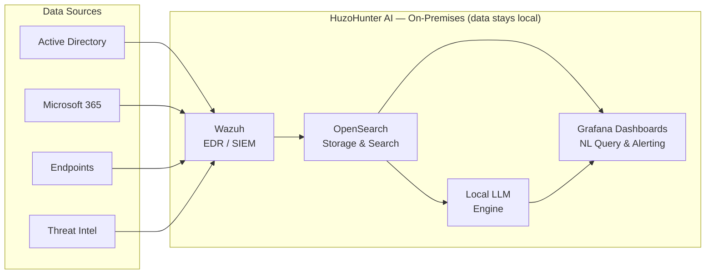

# 🤖 HuzoHunter AI

### Local AI-powered threat hunting & security automation platform

*Enterprise-grade threat detection, investigation, and response — with your data staying fully under your control.*

 

[Website](https://huzosecurity.com) · [Vision](#-vision) · [Features](#-key-features) · [Stack](#-technology-stack) · [Roadmap](#-roadmap) · [Contact](#-contact)

---

## 📖 Overview

**HuzoHunter AI** is a local, privacy-first threat hunting and security automation platform being developed by **[HuzoSecurity Ltd](https://huzosecurity.com)**. It brings advanced detection and AI-assisted investigation to organisations that can't — or won't — send their security telemetry to the cloud.

By running AI models **locally**, HuzoHunter AI delivers the speed and intelligence of modern SOC tooling while keeping sensitive data on-premises and under the organisation's control.

---

## 🎯 Vision

> To provide organisations with advanced threat detection, investigation, and response capabilities — while keeping sensitive data under their own control.

Cloud-based security tooling often means handing your most sensitive logs to a third party. HuzoHunter AI is built on a different principle: **data sovereignty first**. Powerful AI-driven hunting, with nothing leaving your environment.

---

## ✨ Key Features

| | Capability | Description |
|---|---|---|
| 🧠 | **Local AI Deployment** | Run LLM-powered analysis entirely on your own hardware — no cloud dependency |
| 🔍 | **Threat Hunting Automation** | Automate repetitive hunts and surface anomalies across your environment |
| 💡 | **Explainable AI Investigations** | Transparent, human-readable reasoning behind every AI conclusion |
| 🔗 | **Security Event Correlation** | Connect signals across sources to reveal multi-stage attacks |
| 🛡️ | **Vulnerability Management** | Track, prioritise, and contextualise vulnerabilities |
| 🏢 | **Active Directory Integration** | Hunt across identity and authentication telemetry |
| ☁️ | **Microsoft 365 Integration** | Pull and analyse M365 security signals |
| 💬 | **Natural Language Queries** | Ask security questions in plain English |
| 🚨 | **Monitoring & Alerting** | Continuous security monitoring with actionable alerts |

---

## 🏗️ Architecture

*Diagram is illustrative of the intended design during R&D.*

---

## 🛠️ Technology Stack

- **Wazuh** — endpoint detection, log analysis, and security monitoring
- **OpenSearch** — scalable storage, indexing, and search of security data
- **Grafana** — visualisation and dashboards
- **Local Large Language Models (LLMs)** — on-prem AI analysis and investigation
- **NVIDIA GPU acceleration** — fast local inference
- **Threat Intelligence Feeds** — enrichment and context

---

## 👥 Target Market

- 🏬 Small and Medium-sized Businesses (SMBs)
- ⚡ Critical Infrastructure Organisations
- 🏛️ Government and Public Sector
- 🏥 Healthcare Providers

---

## 🗺️ Roadmap

- [x] Define vision, architecture, and core feature set
- [ ] Wazuh + OpenSearch data pipeline (ingest AD / M365 / endpoint telemetry)
- [ ] Local LLM integration for natural-language queries
- [ ] Explainable AI investigation engine
- [ ] Grafana dashboards & alerting
- [ ] Automated threat-hunting playbooks
- [ ] Pilot deployment with early partners

*Currently in the **research and development** phase.*

---

## 📫 Contact

**Robert Huzo** — Founder, HuzoSecurity Ltd

---

© 2026 HuzoSecurity Ltd · Built with a local-first, privacy-first philosophy 🔐
 
<strong>Version 0.5.0</strong> · Last updated 2026-06-10

